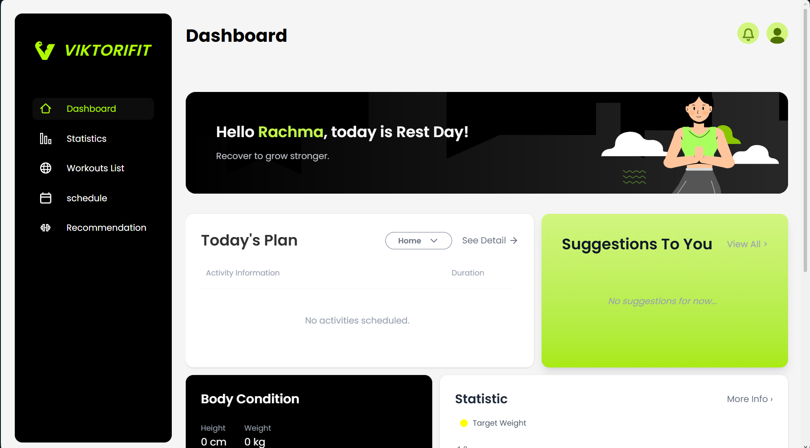

# 🏋️ Viktorifit Machine Learning

A personalized health recommendation system powered by Machine Learning — providing smart suggestions for meals, workout plans, and body progress predictions with low-latency ONNX-optimized models.

## ✨ Features

### 🎯 **Core Functionality**

- **Nutritional Forecasting**: Predicts daily calorie, water, macro & micro nutrient needs
- **Body Metrics Prediction**: Estimates body fat percentage and target weight
- **Workout Recommender**: Personalized workout plans based on user goals
- **Meal Planner**: Smart meal suggestions aligned with daily calorie targets and diet preferences
- **Progress Tracker**: Analyzes training history to predict goal achievement

### ⚡ **Performance**

- **ONNX-Optimized Models**: Regression models exported to ONNX format for low-latency CPU inference
- **Pickle-based Recommenders**: Scikit-learn models for complex recommendation logic
- **FastAPI Ready**: Designed to be served as a production API

### 📊 **Predictions Provided**

- Daily Calories & Water Intake
- Protein, Carbs, Fat, Fiber, Sugar targets
- Body Fat Percentage & Weight estimation
- Workout type, duration & intensity
- Meal packages matching nutritional goals
=======
# ⚡ Viktorifit Machine Learning

[](https://viktorifit.vercel.app)
[](https://railway.app)


**Viktorifit ML** adalah pusat kecerdasan buatan yang menggerakkan ekosistem kesehatan Viktorifit. Sistem ini menyediakan rekomendasi nutrisi, rencana latihan, dan prediksi perkembangan tubuh yang dipersonalisasi sesuai pengguna



---

## ✨ Features

### 🎯 Core Functionality
* **Nutritional Forecasting (ONNX):** Prediksi kebutuhan kalori, air harian, serta makro/mikro nutrisi (Protein, Karbo, Lemak, Serat, Gula) secara real-time.
* **Body Metrics Prediction:** Estimasi persentase lemak tubuh dan proyeksi berat badan masa depan.
* **Workout Recommender (Pickle):** Sistem cerdas yang menentukan jenis olahraga, durasi, dan intensitas berdasarkan profil *Weight Loss, Muscle Gain,* atau *Endurance*.
* **Meal Planner:** Personalisasi paket menu makanan yang selaras dengan target nutrisi harian pengguna.

### 🚀 Optimization & Performance
* **ONNX Integration:** Model regresi dioptimalkan untuk eksekusi CPU yang ringan dan cepat pada lingkungan produksi.
* **Progress Tracking:** Analisis riwayat latihan untuk memprediksi pencapaian target pengguna secara dinamis.
* **Clean Data Pipeline:** Manajemen dataset yang terstruktur untuk proses pelatihan ulang (retraining) yang efisien.

---

## 📂 Project Structure

```text
viktorifit-ml/
├── 📁 data/                      # Dataset mentah & hasil pemrosesan
│   ├── dataset_meal.csv
│   ├── dataset_users.csv
│   ├── dataset_workout_final.csv
│   └── ...
├── 📁 models/                    # Model Registry
│   ├── 📁 onnx/                  # Model teroptimasi untuk production
│   │   ├── Body_Fat_Percentage_y.onnx
│   │   ├── Daily_Calories.onnx
│   │   ├── Target_Protein_g.onnx
│   │   └── ...
│   ├── model_meal.pickle      # Model rekomendasi (Scikit-learn object)
│   ├── model_workout.pickle
│   └── model_progress.pickle
├── 📁 notebooks/                 # Jupyter Notebooks untuk eksperimen & training
│   ├── modeling_dataset_meal.ipynb
│   ├── modeling_dataset_workout.ipynb
│   └── 📁 test_predict/          # Script pengujian inferensi
│       ├── predict_meal.ipynb
│       └── predict_workout.ipynb
├── 📄 requirements.txt           # Daftar dependensi Python
└── 📄 README.md                  # Dokumentasi proyek

---
>>>>>>> e3a76f2b26b938438580affe0212daddf2617c0c

## 🚀 Getting Started

### Prerequisites

<<<<<<< HEAD
- Python 3.11 or later
- Docker (optional, recommended for production)
- pip package manager

### ⚙️ Option 1 — Run with Local Python

#### 1. Clone the repository

```bash
git clone https://github.com/crisvito/viktorifit-ml.git
cd viktorifit-ml
```

> 💡 **Don't have Python?** Download it from [python.org](https://www.python.org/downloads/) and make sure to check **"Add Python to PATH"** during installation.

#### 2. Install dependencies

```bash
pip install -r requirements.txt
```

#### 3. Run the API server

```bash
uvicorn app.app:app --host 0.0.0.0 --port 8000
```

Navigate to [http://localhost:8000/docs](http://localhost:8000/docs) to explore the interactive API documentation.

---

### 🐳 Option 2 — Run with Docker (Recommended for Production)

Make sure [Docker](https://www.docker.com/get-started) is installed on your machine.

#### 1. Clone the repository

```bash
git clone https://github.com/crisvito/viktorifit-ml.git
cd viktorifit-ml
```

#### 2. Build the Docker image

```bash
docker build -t viktorifit-ml .
```

#### 3. Run the container

```bash
docker run -p 8000:8000 viktorifit-ml
```

Navigate to [http://localhost:8000/docs](http://localhost:8000/docs) to explore the interactive API documentation.

=======
* Python 3.8 or later
* Virtual environment (Recommended)
* Git

### Installation

1. **Clone the repository**
```bash
git clone [https://github.com/crisvito/viktorifit-ml.git](https://github.com/crisvito/viktorifit-ml.git)
cd viktorifit-ml

```


2. **Setup Virtual Environment**
```bash
python -m venv venv
source venv/bin/activate  # Unix/macOS
# atau venv\Scripts\activate untuk Windows

```

3. **Install Dependencies**
```bash
pip install -r requirements.txt

```

---

## 🎮 How to Use

1. **Model Training:** Jalankan Jupyter Notebook di folder `notebooks/` untuk melatih ulang model dengan data baru.
2. **Inference (ONNX):** Gunakan skrip berikut untuk melakukan prediksi cepat:
```python
import onnxruntime as ort
import numpy as np

session = ort.InferenceSession("models/onnx/Daily_Calories.onnx")
input_data = np.array([[25, 170, 65]], dtype=np.float32)
result = session.run(None, {"input": input_data})
print("Prediksi Kalori:", result)

```
>>>>>>> e3a76f2b26b938438580affe0212daddf2617c0c
---

## 🛠️ Technical Details

### Tech Stack

<<<<<<< HEAD
- **Language**: Python 3.11+
- **ML Framework**: Scikit-learn
- **Model Format**: ONNX (production), Pickle (recommenders)
- **Inference Runtime**: ONNX Runtime
- **API Framework**: FastAPI
- **Containerization**: Docker

### Project Structure

```
viktorifit-ml/
├── data/                      # Raw & processed datasets
│   ├── dataset_meal.csv
│   ├── dataset_users.csv
│   └── dataset_workout_final.csv
├── models/                    # Model registry
│   ├── onnx/                  # Production-optimized ONNX models
│   │   ├── Body_Fat_Percentage_y.onnx
│   │   ├── Daily_Calories.onnx
│   │   ├── Target_Protein_g.onnx
│   │   └── Daily_Water_ml.onnx
│   ├── model_meal.pickle
│   ├── model_workout.pickle
│   └── model_progress.pickle
├── notebooks/                 # Experiment & training notebooks
│   ├── modeling_dataset_meal.ipynb
│   ├── modeling_dataset_workout.ipynb
│   └── test_predict/
│       ├── predict_meal.ipynb
│       └── predict_workout.ipynb
├── Dockerfile
├── requirements.txt
└── README.md
```

### Browser / Client Support

- Any HTTP client (Postman, curl, browser)
- FastAPI auto-generates interactive docs at `/docs`

## 🚀 Deployment

### Railway (Recommended)

[Railway](https://railway.app) is the easiest way to deploy this project — no environment variables needed, just push and go.

1. Push your code to GitHub
2. Go to [railway.app](https://railway.app) and create a new project
3. Select **"Deploy from GitHub repo"** and choose this repository
4. Railway will automatically detect the `Dockerfile` and build the image
5. Your API will be live at the Railway-provided URL — done! 🎉

## 🤝 Contributing

1. Fork the repository
2. Create your feature branch (`git checkout -b feature/amazing-feature`)
3. Commit your changes (`git commit -m 'Add amazing feature'`)
4. Push to the branch (`git push origin feature/amazing-feature`)
5. Open a Pull Request
=======
* **Modeling:** Scikit-learn, XGBoost, Pickle model, ONNX Runtime
* **Data Processing:** Pandas, NumPy
* **Inference Engine:** FastAPI (Serving API)
* **Experimentation:** Jupyter Notebook

### 🚀 Deployment

* **Frontend (Vercel):** Interface aplikasi di-host di [viktorifit.vercel.app](https://viktorifit.vercel.app).
* **Backend API (Railway):** Server API untuk model Machine Learning di-deploy melalui Railway untuk menjamin skalabilitas dan performa tinggi.

---

## 🤝 Contributing

1. **Fork** the repository
2. **Create** your feature branch (`git checkout -b feature/amazing-feature`)
3. **Commit** your changes (`git commit -m 'Add amazing feature'`)
4. **Push** to the branch (`git push origin feature/amazing-feature`)
5. **Open** a Pull Request
>>>>>>> e3a76f2b26b938438580affe0212daddf2617c0c

---

**Made with ❤️ by Viktorifit Team**

_Empowering your fitness journey with intelligent, data-driven insights._ 🏋️✨
=======
*Transforming health data into personalized fitness journeys!* 🍎💪✨

```
